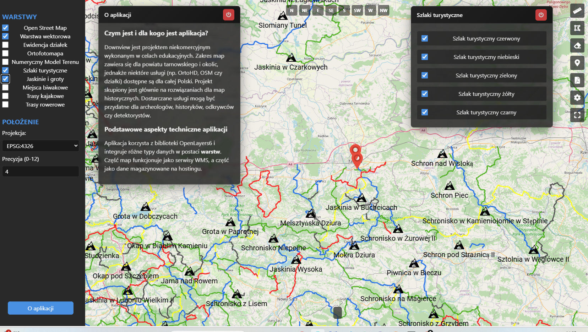

# 🗺️ DownView - Interactive Tourist Map Application

[](https://github.com/pnytko/downview_2.0/actions/workflows/deploy.yml)

🌐 **[Live Demo](https://pnytko.pl/downview-2/)** - Always up to date thanks to Continuous Deployment!



## 📋 Table of Contents
- [About](#about)
- [Features](#features)
- [Technologies](#technologies)
- [Installation](#installation)
- [Usage](#usage)
- [Map Layers](#map-layers)
- [Tools](#tools)

## 🎯 About
DownView is an interactive map application designed for tourists and outdoor enthusiasts. It combines various map layers and tools to enhance the hiking and exploration experience. The application provides detailed trail information, terrain analysis, and measurement tools to help users plan and navigate their outdoor adventures.

Thanks to Continuous Deployment methodology, all updates and improvements are automatically deployed to the production environment, ensuring users always have access to the latest features and fixes.

## ✨ Features

### 🔄 Development & Deployment
- **Continuous Deployment** - automatic deployment of updates
- **Version Control** - Git-based development
- **GitHub Actions** - automated deployment pipeline
- **FTP Deployment** - reliable hosting updates

### 🗺️ Map Layers
- **OpenStreetMap (OSM)** - base map layer
- **High-Resolution Orthophoto** - detailed aerial imagery
- **Land Parcels** - cadastral information
- **DEM (Digital Elevation Model)** - terrain elevation data
- **Tourist Trails** - color-coded hiking paths:
  - Red trails
  - Blue trails
  - Green trails
  - Yellow trails
  - Black trails
- **Cave Locations** - marked cave entrances and information

### 🛠️ Measurement Tools
- **Length Measurement** - calculate distances along paths
- **Area Measurement** - measure terrain areas
- **Custom Markers** - add points of interest
- **PDF Export** - save map views for offline use

### 🎨 Customization
- **Layer Management** - toggle individual layers
- **Opacity Control** - adjust layer visibility
- **Projection Selection** - support for different coordinate systems:
  - EPSG:4326
  - EPSG:3857
- **Coordinate Precision** - adjust coordinate display accuracy
- **Optimized CSS** - reduced file size and improved performance through PurgeCSS

### 🧭 Navigation
- **Direction Control** - rotate map in 8 directions (N, NE, E, SE, S, SW, W, NW)
- **Fullscreen Mode** - maximize map viewing area
- **Position Information** - display current cursor coordinates

## 🔧 Technologies
- **OpenLayers 6** - main mapping library
- **JavaScript (ES6+)** - application logic
- **HTML5 & CSS3** - structure and styling
- **Font Awesome** - interface icons
- **jQuery** - interaction handling

## 💻 Installation
1. Clone the repository:
```bash
git clone https://github.com/your-username/downview.git
```

2. Start a local server (e.g., using Python):
```bash
python -m http.server
```

3. Open your browser and navigate to:
```
http://localhost:8000
```

## 🎮 Usage

### Basic Navigation
- **Zoom** - use mouse wheel
- **Pan** - drag the map with left mouse button
- **Rotate** - use direction buttons at the top of the map

### Measurements
1. Select a measurement tool from the toolbar
2. Click on the map to set measurement points
3. Double-click to finish measurement

### PDF Export
1. Set desired map view
2. Click the PDF export button
3. Choose save location

## 📝 License
This project is available under the MIT License. See [LICENSE](LICENSE) for details.

## 🤝 Contributing
We welcome contributions! If you have ideas for improvements:
1. Fork the repository
2. Create a branch for your changes
3. Submit a pull request

## 📧 Contact
For questions or suggestions, reach out at:
`pnytko98 [at] gmail [dot] com`

## 🌟 Acknowledgments
Special thanks to:
- OpenLayers community
- OpenStreetMap contributors
- All contributors and users of DownView
