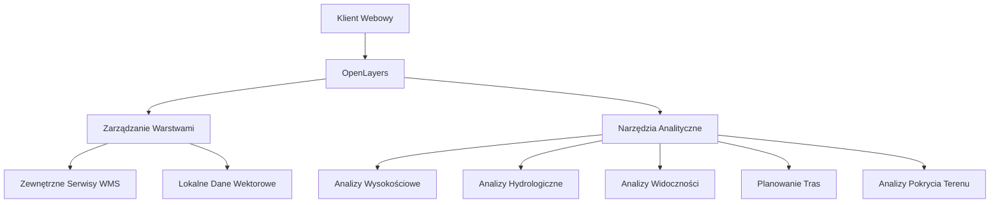

# Plan Modernizacji Aplikacji DownView 2.0

## 1. Wprowadzenie

Na podstawie analizy obecnej funkcjonalności aplikacji DownView 2.0 oraz rozmowy z klientem, przygotowałem zmodyfikowany plan rozwoju aplikacji, który skupia się na dwóch głównych etapach:

1. **Etap I: Rozszerzenie warstw mapowych dla Polski** - ze szczególnym uwzględnieniem danych przyrodniczych i geologicznych, podzielonych logicznie tematycznie
2. **Etap II: Implementacja zaawansowanych narzędzi analitycznych terenu** - w formie 2D, bez elementów 3D, VR czy AR

Plan ten ma na celu wzbogacenie DownView 2.0 o nowe warstwy i funkcje analityczne, przy zachowaniu prostoty architektury i korzystaniu z ogólnodostępnych serwisów WMS.

## 2. Obecny Stan Aplikacji

Aktualnie DownView 2.0 oferuje następujące funkcjonalności:

### Warstwy mapowe:
- OpenStreetMap (OSM) jako warstwa bazowa
- Ortofotomapa wysokiej rozdzielczości
- Model terenu (DEM)
- Działki ewidencyjne
- Szlaki turystyczne (czerwone, niebieskie, zielone, żółte, czarne)
- Trasy kajakowe
- Miejsca biwakowe
- Trasy rowerowe

### Narzędzia:
- Pomiary odległości i powierzchni
- Dodawanie znaczników
- Informacje o pogodzie
- Geolokalizacja użytkownika
- Obsługa plików GPX, KML, KMZ
- Rotacja mapy

## 3. ETAP I: Rozszerzone Warstwy Mapowe dla Polski

### 3.1. Warstwy Przyrodnicze

#### 3.1.1. Obszary Chronione
- **Parki Narodowe** (WMS z GDOŚ)
  - Granice parków
  - Strefy ochronne
  - Ścieżki edukacyjne
  
- **Rezerwaty Przyrody** (WMS z GDOŚ)
  - Granice rezerwatów
  - Typy rezerwatów (leśne, torfowiskowe, stepowe, itp.)
  
- **Parki Krajobrazowe** (WMS z GDOŚ)
  - Granice parków
  - Punkty informacyjne
  
- **Obszary Natura 2000** (WMS z GDOŚ)
  - Obszary specjalnej ochrony ptaków (OSO)
  - Specjalne obszary ochrony siedlisk (SOO)
  
- **Pomniki Przyrody** (WMS z GDOŚ)
  - Lokalizacje pomników
  - Typy (drzewa, głazy, źródła, itp.)

#### 3.1.2. Lasy i Roślinność
- **Lasy Państwowe** (WMS z Lasów Państwowych)
  - Granice nadleśnictw
  - Typy lasów (iglaste, liściaste, mieszane)
  - Wiek drzewostanów
  
- **Siedliska Przyrodnicze** (WMS z GDOŚ)
  - Typy siedlisk
  - Stan zachowania
  
- **Korytarze Ekologiczne** (WMS z GDOŚ)
  - Główne korytarze
  - Lokalne korytarze

#### 3.1.3. Hydrologia
- **Wody Powierzchniowe** (WMS z KZGW)
  - Rzeki z klasyfikacją
  - Jeziora z informacją o powierzchni
  - Zbiorniki retencyjne
  
- **Źródła i Wywierzyska** (WMS z PIG)
  - Lokalizacje źródeł
  - Typy źródeł
  
- **Obszary Zalewowe** (WMS z KZGW)
  - Zasięgi zalewów o różnym prawdopodobieństwie
  - Historyczne powodzie

### 3.2. Warstwy Geologiczne

#### 3.2.1. Geologia Powierzchniowa
- **Mapa Geologiczna Polski** (WMS z PIG)
  - Formacje geologiczne
  - Wiek skał
  
- **Odsłonięcia Geologiczne** (WMS z PIG)
  - Lokalizacje odsłonięć
  - Typy skał
  
- **Kamieniołomy i Wyrobiska** (WMS z PIG)
  - Czynne i nieczynne kamieniołomy
  - Typy wydobywanych surowców

#### 3.2.2. Jaskinie i Formy Krasowe
- **Jaskinie Polski** (WMS z PIG)
  - Lokalizacje jaskiń
  - Długość i głębokość
  - Dostępność dla turystów
  
- **Formy Krasowe** (WMS z PIG)
  - Leje krasowe
  - Ponory
  - Wywierzyska

#### 3.2.3. Gleby i Podłoże
- **Mapa Glebowa** (WMS z IUNG)
  - Typy gleb
  - Klasy bonitacyjne
  
- **Erozja Gleb** (WMS z IUNG)
  - Obszary zagrożone erozją
  - Stopień erozji

### 3.3. Warstwy Meteorologiczne i Klimatyczne

#### 3.3.1. Dane Meteorologiczne
- **Stacje Meteorologiczne** (WMS z IMGW)
  - Lokalizacje stacji
  - Aktualne pomiary
  
- **Opady Atmosferyczne** (WMS z IMGW)
  - Średnie roczne opady
  - Rozkład opadów w ciągu roku

#### 3.3.2. Klimat
- **Strefy Klimatyczne** (WMS z IMGW)
  - Podział na regiony klimatyczne
  - Charakterystyka klimatu
  
- **Temperatura Powietrza** (WMS z IMGW)
  - Średnie roczne temperatury
  - Amplitudy temperatur

### 3.4. Warstwy Topograficzne

#### 3.4.1. Rzeźba Terenu
- **Cieniowanie Rzeźby Terenu** (WMS z GUGiK)
  - Wizualizacja ukształtowania terenu
  
- **Poziomice** (WMS z GUGiK)
  - Linie wysokościowe co 10m
  - Linie wysokościowe co 50m
  
- **Punkty Wysokościowe** (WMS z GUGiK)
  - Szczyty z wysokościami
  - Przełęcze z wysokościami

#### 3.4.2. Mapy Topograficzne
- **Mapa Topograficzna 1:10 000** (WMS z GUGiK)
- **Mapa Topograficzna 1:25 000** (WMS z GUGiK)
- **Mapa Topograficzna 1:50 000** (WMS z GUGiK)
- **Mapa Topograficzna 1:100 000** (WMS z GUGiK)

### 3.5. Warstwy Infrastrukturalne

#### 3.5.1. Infrastruktura Turystyczna
- **Schroniska i Bazy Noclegowe** (WMS z PTTK)
  - Lokalizacje schronisk
  - Informacje o dostępności
  
- **Punkty Widokowe** (WMS z PTTK)
  - Lokalizacje punktów
  - Panoramy
  
- **Parkingi Leśne i Miejsca Odpoczynku** (WMS z Lasów Państwowych)
  - Lokalizacje parkingów
  - Wyposażenie (wiaty, ławki, itp.)

#### 3.5.2. Infrastruktura Komunikacyjna
- **Drogi Leśne i Polne** (WMS z Lasów Państwowych)
  - Klasyfikacja dróg
  - Dostępność dla ruchu
  
- **Szlaki Konne** (WMS z PTTK)
  - Przebieg szlaków
  - Trudność

## 4. ETAP II: Zaawansowane Narzędzia Analityczne Terenu (2D)

### 4.1. Analizy Wysokościowe

#### 4.1.1. Profile Wysokościowe
- **Interaktywne Profile Terenu**
  - Tworzenie profili wysokościowych wzdłuż dowolnej ścieżki
  - Analiza nachyleń i przewyższeń
  - Obliczanie trudności trasy na podstawie profilu
  - Eksport profili do formatów graficznych i danych

#### 4.1.2. Mapy Nachyleń i Ekspozycji
- **Generowanie Map Nachyleń**
  - Wizualizacja nachyleń terenu w formie mapy cieplnej
  - Konfigurowalne przedziały nachyleń
  - Identyfikacja potencjalnie niebezpiecznych obszarów (strome zbocza)

- **Mapy Ekspozycji Stoków**
  - Wizualizacja ekspozycji stoków (kierunki świata)
  - Analiza nasłonecznienia w zależności od ekspozycji

### 4.2. Analizy Hydrologiczne

#### 4.2.1. Kierunki Spływu Wody
- **Wizualizacja Kierunków Spływu**
  - Automatyczne generowanie linii spływu wody na podstawie DEM
  - Identyfikacja zlewni i działów wodnych
  - Analiza potencjalnych zagrożeń powodziowych

#### 4.2.2. Analiza Zlewni
- **Interaktywne Wyznaczanie Zlewni**
  - Wyznaczanie zlewni dla dowolnego punktu
  - Obliczanie powierzchni zlewni
  - Analiza ukształtowania zlewni

### 4.3. Analizy Widoczności

#### 4.3.1. Mapy Widoczności
- **Generowanie Map Widoczności**
  - Wizualizacja obszarów widocznych z wybranego punktu
  - Określanie zasięgu widoczności
  - Identyfikacja najlepszych punktów widokowych

#### 4.3.2. Analiza Przesłonięć
- **Identyfikacja Przesłonięć Terenu**
  - Analiza przesłonięć widoku przez elementy terenu
  - Optymalizacja lokalizacji punktów widokowych

### 4.4. Planowanie Tras

#### 4.4.1. Inteligentny Planer Tras
- **Automatyczne Generowanie Tras**
  - Wyznaczanie optymalnych tras między punktami
  - Uwzględnianie preferencji użytkownika (unikanie stromych podejść, preferowanie określonych typów dróg)
  - Szacowanie czasu przejścia z uwzględnieniem trudności terenu
  - Analiza profilu wysokościowego planowanej trasy

#### 4.4.2. Analiza Trudności Szlaków
- **Klasyfikacja Trudności**
  - Automatyczna klasyfikacja trudności szlaków
  - Identyfikacja potencjalnie niebezpiecznych odcinków
  - Rekomendacje dotyczące wyposażenia
  - Sezonowe zmiany trudności (np. zimowe warunki)

### 4.5. Analizy Pokrycia Terenu

#### 4.5.1. Klasyfikacja Pokrycia Terenu
- **Analiza Typów Pokrycia**
  - Wizualizacja pokrycia terenu (lasy, łąki, tereny zabudowane)
  - Identyfikacja typów lasów (iglaste, liściaste, mieszane)
  - Analiza struktury wiekowej drzewostanów

#### 4.5.2. Analiza Zmian w Czasie
- **Porównanie Historycznych Danych**
  - Porównanie historycznych i aktualnych ortofotomap
  - Wykrywanie zmian w pokryciu terenu
  - Analiza tempa i kierunków zmian

### 4.6. Nowe Innowacyjne Narzędzia Analityczne

#### 4.6.1. Analiza Nasłonecznienia
- **Mapy Nasłonecznienia**
  - Obliczanie czasu nasłonecznienia dla dowolnego punktu
  - Wizualizacja zmian nasłonecznienia w ciągu dnia/roku
  - Identyfikacja miejsc o najlepszym nasłonecznieniu

#### 4.6.2. Analiza Akustyczna
- **Mapy Hałasu**
  - Modelowanie propagacji hałasu w terenie
  - Identyfikacja "cichych stref"
  - Analiza wpływu ukształtowania terenu na propagację dźwięku

#### 4.6.3. Analiza Widoczności Nieba
- **Mapa Zanieczyszczenia Światłem**
  - Wizualizacja obszarów o niskim zanieczyszczeniu światłem
  - Identyfikacja miejsc idealnych do obserwacji astronomicznych
  - Uwzględnienie ukształtowania terenu i pokrycia roślinnością

#### 4.6.4. Analiza Dostępności
- **Mapy Dostępności Terenu**
  - Analiza dostępności terenu dla różnych grup użytkowników (piesi, rowerzyści, osoby z niepełnosprawnościami)
  - Identyfikacja barier terenowych
  - Rekomendacje dotyczące dostępności

## 5. Organizacja Warstw w Interfejsie Użytkownika

Aby zapewnić intuicyjną nawigację po rozbudowanym zestawie warstw, proponuję następującą strukturę menu:

```
├── Mapy Bazowe
│   ├── OpenStreetMap
│   ├── Ortofotomapa
│   ├── Mapa Topograficzna
│   └── Cieniowanie Rzeźby Terenu
│
├── Przyroda
│   ├── Obszary Chronione
│   │   ├── Parki Narodowe
│   │   ├── Rezerwaty Przyrody
│   │   ├── Parki Krajobrazowe
│   │   ├── Obszary Natura 2000
│   │   └── Pomniki Przyrody
│   │
│   ├── Lasy i Roślinność
│   │   ├── Typy Lasów
│   │   ├── Wiek Drzewostanów
│   │   ├── Siedliska Przyrodnicze
│   │   └── Korytarze Ekologiczne
│   │
│   └── Hydrologia
│       ├── Rzeki i Jeziora
│       ├── Źródła i Wywierzyska
│       └── Obszary Zalewowe
│
├── Geologia
│   ├── Formacje Geologiczne
│   ├── Odsłonięcia i Kamieniołomy
│   ├── Jaskinie i Formy Krasowe
│   └── Gleby
│
├── Klimat i Pogoda
│   ├── Stacje Meteorologiczne
│   ├── Opady Atmosferyczne
│   ├── Temperatura Powietrza
│   └── Strefy Klimatyczne
│
├── Turystyka
│   ├── Szlaki Piesze
│   │   ├── Czerwone
│   │   ├── Niebieskie
│   │   ├── Zielone
│   │   ├── Żółte
│   │   └── Czarne
│   │
│   ├── Szlaki Rowerowe
│   ├── Szlaki Konne
│   ├── Trasy Kajakowe
│   ├── Miejsca Biwakowe
│   └── Infrastruktura
│       ├── Schroniska
│       ├── Punkty Widokowe
│       └── Parkingi i Miejsca Odpoczynku
│
└── Administracja
    ├── Granice Administracyjne
    ├── Działki Ewidencyjne
    └── Obszary Zabudowane
```

## 6. Implementacja Techniczna

### 6.1. Architektura Aplikacji

Zgodnie z wytycznymi, architektura aplikacji pozostanie prosta, bez wykorzystania kontenerów i GeoServerów. Aplikacja będzie korzystać z ogólnodostępnych serwisów WMS.



### 6.2. Technologie

Proponuję wykorzystanie następujących technologii:

1. **Frontend**:
   - Biblioteka mapowa: OpenLayers (aktualizacja do najnowszej wersji)
   - JavaScript (ES6+) z modułami
   - HTML5 & CSS3
   - Font Awesome dla ikon
   - jQuery (opcjonalnie rozważyć przejście na czysty JavaScript)

2. **Źródła danych**:
   - Ogólnodostępne serwisy WMS (GUGiK, GDOŚ, PIG, IMGW, Lasy Państwowe, KZGW, itp.)
   - Lokalne dane wektorowe dla wyników analiz

3. **Przetwarzanie danych**:
   - Wykorzystanie API OpenLayers do analiz przestrzennych
   - Turf.js do zaawansowanych analiz przestrzennych po stronie klienta
   - D3.js do wizualizacji danych (wykresy, profile wysokościowe)

## 7. Plan Wdrożenia

Proponuję następujący harmonogram wdrożenia:

### Etap I: Rozszerzenie Warstw Mapowych (2 miesiące)
- Integracja nowych źródeł danych WMS
- Implementacja warstw przyrodniczych
- Implementacja warstw geologicznych
- Reorganizacja interfejsu zarządzania warstwami
- Optymalizacja wydajności ładowania warstw

### Etap II: Implementacja Narzędzi Analitycznych (5 miesięcy)
- **Faza 1 (2 miesiące)**: Podstawowe narzędzia analityczne
  - Implementacja analiz wysokościowych
  - Implementacja analiz hydrologicznych
  - Implementacja analiz widoczności
  - Podstawowe planowanie tras

- **Faza 2 (3 miesiące)**: Zaawansowane analizy
  - Implementacja analiz pokrycia terenu
  - Zaawansowane wizualizacje danych
  - Implementacja nowych innowacyjnych narzędzi analitycznych
  - Optymalizacja wydajności analiz

## 8. Potencjalne Źródła Danych WMS

Dla realizacji projektu proponuję wykorzystanie następujących źródeł danych WMS:

1. **Główny Urząd Geodezji i Kartografii (GUGiK)**:
   - Ortofotomapa
   - Mapy topograficzne
   - Numeryczny Model Terenu
   - Cieniowanie rzeźby terenu

2. **Generalna Dyrekcja Ochrony Środowiska (GDOŚ)**:
   - Obszary chronione
   - Siedliska przyrodnicze
   - Korytarze ekologiczne

3. **Państwowy Instytut Geologiczny (PIG)**:
   - Mapa geologiczna
   - Jaskinie i formy krasowe
   - Odsłonięcia geologiczne

4. **Lasy Państwowe**:
   - Typy lasów
   - Wiek drzewostanów
   - Infrastruktura leśna

5. **Krajowy Zarząd Gospodarki Wodnej (KZGW)**:
   - Wody powierzchniowe
   - Obszary zalewowe
   - Zbiorniki wodne

6. **Instytut Meteorologii i Gospodarki Wodnej (IMGW)**:
   - Stacje meteorologiczne
   - Dane klimatyczne
   - Opady atmosferyczne

7. **Polskie Towarzystwo Turystyczno-Krajoznawcze (PTTK)**:
   - Szlaki turystyczne
   - Schroniska
   - Punkty widokowe

## 9. Korzyści z Wdrożenia

Wdrożenie proponowanych zmian przyniesie następujące korzyści:

1. **Dla Użytkowników**:
   - Dostęp do unikalnych danych przyrodniczych i geologicznych
   - Zaawansowane narzędzia do analizy terenu
   - Lepsze planowanie aktywności w terenie
   - Głębsze zrozumienie środowiska naturalnego

2. **Dla Projektu**:
   - Wyróżnienie się na tle konkurencji
   - Potencjał do komercjalizacji
   - Możliwość współpracy z instytucjami naukowymi
   - Rozwój w kierunku platformy edukacyjnej

## 10. Podsumowanie

Zmodyfikowany plan rozwoju aplikacji DownView 2.0 zakłada znaczące rozszerzenie dostępnych warstw mapowych dla Polski, ze szczególnym uwzględnieniem danych przyrodniczych i geologicznych, oraz implementację zaawansowanych narzędzi analitycznych terenu w formie 2D. 

Kluczowym elementem planu jest logiczna organizacja warstw tematycznych, co ułatwi użytkownikom nawigację po rozbudowanym zestawie danych. Dodatkowo, zaproponowane narzędzia analityczne pozwolą na głębsze zrozumienie terenu i jego cech, co będzie stanowić unikalną wartość aplikacji.

Plan zakłada wykorzystanie ogólnodostępnych serwisów WMS, bez konieczności wdrażania złożonej infrastruktury serwerowej, co pozwoli na szybsze i bardziej ekonomiczne wdrożenie nowych funkcjonalności.