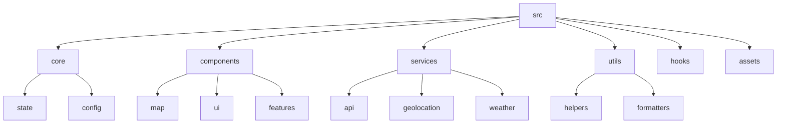

# Plan modernizacji aplikacji DownView 2.0

## 1. Reorganizacja struktury projektu

### 1.1. Wprowadzenie architektury modułowej

### 1.2. Standaryzacja zarządzania stanem
- Implementacja wzorca zarządzania stanem (np. Redux lub Context API)
- Centralizacja logiki stanu aplikacji
- Rozdzielenie logiki biznesowej od komponentów UI

## 2. Naprawa bugów

### 2.1. Problemy z markerami
- Refaktoryzacja kodu obsługi markerów
- Implementacja poprawnej obsługi usuwania markerów
- Optymalizacja dodawania nowych markerów

### 2.2. Problemy z wydajnością
- Implementacja leniwego ładowania warstw mapy
- Optymalizacja renderowania przy wielu aktywnych warstwach
- Wprowadzenie mechanizmu buforowania danych map

### 2.3. Błędy API
- Poprawa obsługi błędów w API pogodowym
- Implementacja mechanizmu retry dla nieudanych żądań
- Dodanie fallbacków dla niedostępnych usług

### 2.4. Problemy z responsywnością
- Przebudowa interfejsu dla lepszej obsługi urządzeń mobilnych
- Implementacja podejścia mobile-first
- Optymalizacja kontrolek dla ekranów dotykowych

### 2.5. Problemy z obsługą plików
- Poprawa mechanizmu przeciągania i upuszczania plików GPX/KML
- Dodanie walidacji plików przed przetwarzaniem
- Implementacja obsługi większych plików

## 3. Modernizacja kodu

### 3.1. Wprowadzenie nowoczesnych wzorców projektowych
- Implementacja wzorca Repository dla dostępu do danych
- Zastosowanie wzorca Adapter dla integracji z zewnętrznymi API
- Wykorzystanie wzorca Observer dla komunikacji między komponentami

### 3.2. Poprawa jakości kodu
- Standaryzacja nazewnictwa i stylu kodu
- Dodanie dokumentacji JSDoc
- Implementacja mechanizmu logowania błędów

### 3.3. Optymalizacja wydajności
- Implementacja technik memoizacji dla kosztownych obliczeń
- Optymalizacja renderowania komponentów UI
- Wprowadzenie mechanizmów cache dla danych map

## 4. Bezpieczeństwo i stabilność

### 4.1. Obsługa błędów
- Implementacja globalnego mechanizmu obsługi błędów
- Dodanie szczegółowego logowania błędów
- Wprowadzenie przyjaznych dla użytkownika komunikatów o błędach

### 4.2. Bezpieczeństwo
- Sanityzacja danych wejściowych
- Zabezpieczenie przed atakami XSS
- Implementacja mechanizmów rate-limiting dla API

### 4.3. Testowanie
- Dodanie testów jednostkowych dla kluczowych funkcji
- Implementacja testów integracyjnych dla głównych przepływów
- Konfiguracja CI/CD dla automatycznego testowania

## 5. Nowe funkcjonalności

### 5.1. Ulepszenia UX
- Dodanie animacji przejść między widokami
- Implementacja trybu ciemnego/jasnego
- Dodanie opcji personalizacji interfejsu

### 5.2. Rozszerzenia funkcjonalności map
- Dodanie opcji eksportu map do PDF/obrazu
- Implementacja zaawansowanych narzędzi pomiarowych
- Dodanie opcji udostępniania lokalizacji

## 6. Plan wdrożenia

### 6.1. Faza 1: Refaktoryzacja struktury projektu
- Reorganizacja plików i katalogów
- Standaryzacja interfejsów modułów
- Implementacja nowego systemu zarządzania stanem

### 6.2. Faza 2: Naprawa krytycznych bugów
- Rozwiązanie problemów z markerami
- Naprawa błędów API
- Poprawa obsługi plików

### 6.3. Faza 3: Optymalizacja wydajności
- Implementacja leniwego ładowania
- Optymalizacja renderowania
- Poprawa responsywności

### 6.4. Faza 4: Nowe funkcjonalności i testy
- Dodanie nowych funkcji
- Implementacja testów
- Finalne poprawki i optymalizacje